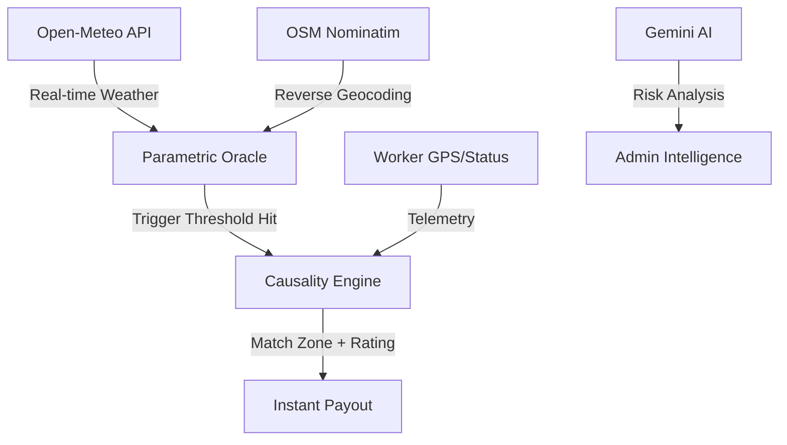

# GigShield: Parametric Insurance for the Indian Gig Economy 🛡️
**Precision Underwriting. Zero-Touch Payouts. AI-Driven Resilience.**

GigShield is a high-fidelity insurtech platform designed to protect India's 8M+ gig workers (Zomato, Swiggy, Blinkit riders) from income volatility caused by external environmental disruptions.

---

## 🏛️ Project Vision
Traditional insurance fails gig workers due to long claim cycles, paperwork, and "basis risk." GigShield solves this with **Parametric Smart Contracts**:
- **Trigger-Based:** If the weather breaks, you get paid. Period.
- **Zero-Touch:** No claim forms, no investigation, no waiting.
- **Instant:** UPI-integrated payouts triggered by real-time IoT and Satellite data.

---

## 🚀 Key Innovations

### 1. Parametric Payout Engine (Open-Meteo Integration)
GigShield fetches real-time telemetry from **Open-Meteo API** and **OSM Nominatim** to cross-reference a worker's GPS location with live weather events.
- **🌧️ Heavy Rain:** >50mm/hr precipitation triggers instant support.
- **🌫️ Critical AQI:** >300 PM2.5 levels trigger respiratory hazard payouts.
- **🔥 Extreme Heat:** >42°C detected triggers worker safety offsets.

### 2. Star-Rating Adjusted Payouts (SRAP)
GigShield rewards reliability by integrating with platform delivery ratings (Zomato/Swiggy stars).
- **5⭐ Platinum:** ₹750 max payout.
- **3⭐ Silver:** ₹500 base payout.
- **1⭐ Probation:** Payouts suspended until service quality improves.

### 3. AI Risk Analyst (Gemini 2.0 Flash) 🧠
The Admin Intelligence portal is powered by a **Gemini 2.0 Flash LLM**. Admins can query the "Risk Analyst" for real-time recommendations on trigger events, actuarial trends, and regional hazard depth.

---

## 🗝️ Judge Demo Credentials
To explore the high-fidelity portals, use these keys:

| Portal | Role | Access Key / Phone |
|---|---|---|
| **Super Admin** | Control Center | `GIGSHIELD26` |
| **Partner Portal** | Zomato Admin | `ZOMATO2026` |
| **Partner Portal** | Swiggy Admin | `SWIGGY2026` |
| **Worker App** | Delivery Rider | Any 10-digit number (OTP is simulated) |

---

## 🛠️ Tech Stack
- **Frontend:** React 19, Tailwind CSS (Custom "Midnight" Theme).
- **Intelligence:** Google Gemini 2.0 Flash API.
- **Telemetry:** Open-Meteo API (Weather), Nominatim (Geocoding).
- **Communication:** Socket.io (Live Payout Ticker), Twilio (SMS Notifications).
- **Persistence:** MongoDB Atlas (Cloud Database).

---

## 📋 Standard Exclusions (Compliance)
As a production-grade prototype, GigShield adheres to standard IRDAI Sandbox exclusions:
- Fraudulent GPS spoofing or location tampering.
- Illegal activities or substance abuse during shifts.
- Government-mandated lockdowns not tied to weather triggers.
- Intentional self-harm or vehicle neglect.

---

## 🏗️ Setup & Installation

1. **Install Dependencies:**
   ```bash
   npm install
   ```

2. **Environment Variables:**
   Create a `.env` in the root and add:
   ```env
   VITE_GEMINI_API_KEY=your_key_here
   MONGODB_URI=your_atlas_uri
   ```

3. **Run Dev Server:**
   ```bash
   npm run dev
   ```

4. **Production Build:**
   ```bash
   npm run build
   ```

---

## 🗺️ System Architecture



---
**Submission for: Innovation Hackathon 2026**
*Transforming the safety net for the backbone of India's logistics economy.*
