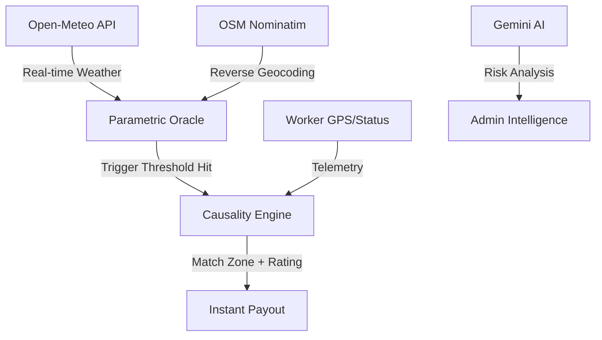

# EarnSure: Autonomous Parametric Insurance for India's 🇮🇳 Gig Economy
**Precision Underwriting. Zero-Touch Payouts. AI-Driven Resilience.**

EarnSure is a high-fidelity insurtech demonstration for the **Innovation Hackathon 2026**. It solves the "income volatility" problem for 8M+ food delivery riders (Zomato, Swiggy, Blinkit) by using real-time weather telemetry and autonomous smart-contract logic.

---

### 🔥 The Innovation (Solving for Bharat)
Traditional insurance fails gig workers due to long claim cycles, paperwork, and investigator visits. EarnSure replaces these with a **Digital Shield**:
- **Triggers**: Heavy rain (>50mm), Severe AQI (>350), or Gridlock (>45m) trigger instant payouts.
- **Parametric Protocol**: No human intervention. If the "Oracle" (Open-Meteo) matches the worker's GPS, the capital is released.
- **SRAP Implementation**: EarnSure rewards reliability. 5-star riders get ₹750/event, while new riders start at the ₹350 base tier.

---

### 🎨 High-Fidelity Experience
We have built three distinct portals to showcase the entire ecosystem:

| Portal | Role | Access Key / Phone |
|---|---|---|
| **Super Admin** | Underwriting & AI Intelligence | `EARNSURE2026` |
| **Logistics Partner** | Zomato/Swiggy Analytics | `ZOMATO2026` |
| **Worker App** | The Rider Dashboard | Any 10-digit number (OTP is simulated) |

---

### 🧠 Intelligence Layer (Gemini 2.0 Flash)
The **Admin Intelligence Portal** is powered by Google's **Gemini 2.0 Flash LLM**. 
- It acts as an **Actuarial Risk Analyst**, processing millions of telemetry data points to provide natural language risk recommendations.
- Admins can query: *"What is the threat level for delivery riders in Mumbai today?"* and get an instant parametric risk assessment.

---

### 🛠️ Tech Stack & Service Grid
- **Frontend**: React 19, Tailwind CSS (Custom "Midnight" Premium Theme).
- **Intelligence**: Gemini 2.0 Flash LLM API.
- **Telemetry Oracles**: Open-Meteo API (Weather), OSM Nominatim (Geocoding).
- **Real-Time Data**: Socket.io (Live Payout Tickers & Telemetry Streams).
- **Communication**: Twilio SMS (Mocked for Demo).
- **Database**: MongoDB Atlas (Cloud Persistence).

---

### 🏗️ Setup & Installation

1. **Install Gear:**
   ```bash
   npm install
   ```
2. **Environment Configuration:**
   Create a `.env` in the root (and in `/backend`) with:
   ```env
   VITE_GEMINI_API_KEY=AIzaSyCNJPv_...
   MONGODB_URI=mongodb+srv://...
   ```
3. **Launch Engine:**
   ```bash
   npm run dev
   ```

---

### 📋 Standard Exclusions (Compliance)
EarnSure adheres to **IRDAI Sandbox** and **DPDP Act 2023** standards:
- Fraudulent GPS spoofing or location tampering is automatically detected.
- Payouts are restricted to active shift hours verified by Platform Partners.
- Payouts are suspended for riders with < 2.0 rating (Probation).

---

### 🗺️ System Architecture



---
**Submission for: Innovation Hackathon 2026**
*Protecting the backbone of India's logistics economy.*
